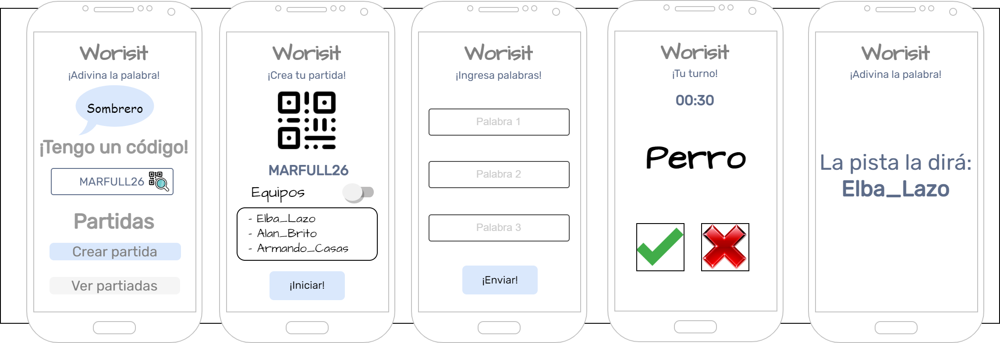

<p align="center">
  <a href="https://marfullsen.github.io/Worisit-the-game/" rel="noopener">
 </a>
</p>

<div align="center">

# Worisit, Guess what it is.

[](https://marfullsen.github.io/Worisit-the-game/)
[](https://vuejs.org/)
[](https://cli.vuejs.org/)
[](https://router.vuejs.org/)
[](https://tailwindcss.com/)

</div>

<p align="center">
  <a href="https://marfullsen.github.io/Worisit-the-game/" rel="noopener">
  </a>
</p>

<p align="center">
  Multiplayer guessing game, guess the word.
</p>

## Project setup
```
npm install
```

### Compiles and hot-reloads for development
```
npm run serve
```

### Compiles and minifies for production
```
npm run build
```

## Referencias

- [Extractor de paletas de imágenes](https://coolors.co/image-picker)
- [Install Tailwind CSS with Vue 3 and Vite](https://tailwindcss.com/docs/guides/vite)
- [Gradientes con CSS Gradient](https://cssgradient.io/)
- [More Gradients](https://mycolor.space/gradient3)
- [Neon Fonts](https://css-tricks.com/how-to-create-neon-text-with-css/)
- [Favicon Generator](https://www.favicon-generator.org/)
- <a href="https://es.vecteezy.com/vectores-gratis/dise%C3%B1o">Diseño Vectores por Vecteezy</a>

### Fonts

- [Ubuntu](https://fonts.google.com/specimen/Ubuntu)
- [Indie Flower](https://fonts.google.com/specimen/Indie+Flower)